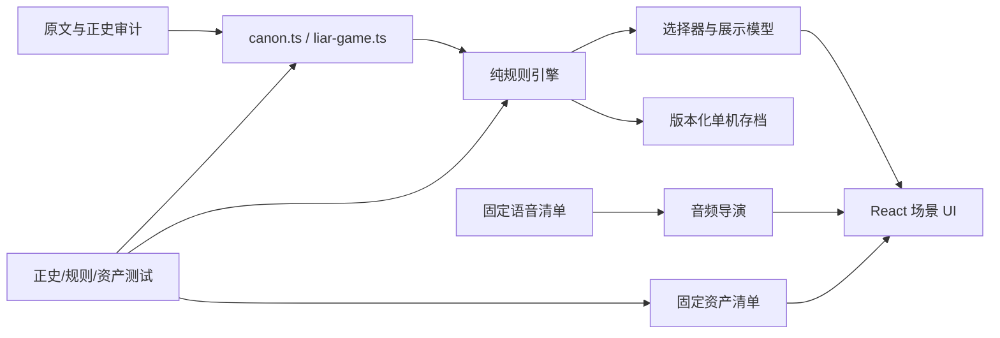
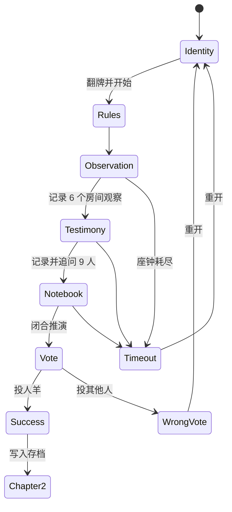
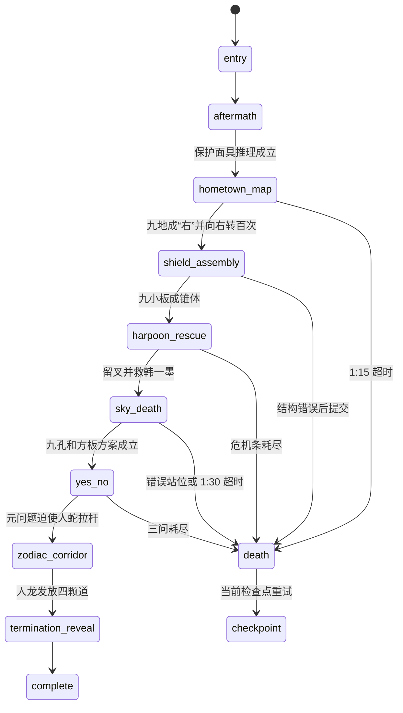

# 《十日终焉》单机剧情桌游技术交接文档

- 最后核对日期：2026-08-06
- 项目目录：克隆仓库后的项目根目录
- 代码仓库：`https://github.com/firefoxy1015/zhongyan`
- 生产环境：`https://zhongyan.onrender.com`
- 当前主分支：`main`
- 本交接对应的游戏代码基线：`61175c4`（第一章立绘与调试入口修复完成）

> 这是一份给下一位技术人员直接接手的实施说明，不是宣传稿。凡是本文与实际运行结果冲突，按“线上运行行为 > 当前代码 > 清单与测试 > 本文 > 旧计划”的顺序回查。

---

## 1. 先读这一页：项目到底要做什么

这是《十日终焉》的**非官方同人单机剧情 RPG / 桌游化推理游戏**。

当前优先级不是联机，而是：

1. 用桌游式操作让玩家亲手完成原著中的观察、推理、选择、合作和死亡游戏。
2. 严格复刻原著事件顺序、角色身份、行为、伤情、游戏规则、关键台词、伏笔和结局。
3. 立绘、场景、动画、固定角色语音、BGM 和音效必须成为游戏体验的一部分，不能退化成资料展示页或语音素材验收页。
4. 玩家主要扮演齐夏；错误选择可以死亡，但成功路线必须回到原著正史。
5. 当前先完成单机章节。`/room` 联机房仍保留在代码中，但不要把开发资源重新转回联机，除非产品负责人明确改优先级。

### 1.1 不可违反的产品命令

- **原著优先**：用户提供的全文是剧情事实的最高来源。
- **先 PLAN 后编码**：每个新章节必须先冻结原文范围、角色状态、证据链、玩法、资产、动画、语音、失败分支和验收标准，确认后再写代码。
- **不得原创替换正史**：不能新增原创主角、隐藏身份、规则或结局来代替原著内容。
- **所有追问由齐夏发出**：齐夏是成年男性，不能出现女声或把追问归给证词角色。
- **角色永久锁定**：角色姓名、性别、职业、口音、服装方向、立绘和音色一旦进入角色圣经，不得在下一章随意改变。
- **静态语音**：固定对白只生成一次，保存为本地文件；运行时禁止临时 TTS、禁止每次点击重新生成、禁止失败后换音色。
- **错误必须说明白**：游戏可以死亡，但错误提交必须指出具体错项与原因，不能只扣时间或直接判死。
- **不泄露答案**：观察层只显示原始事实；答案只能由玩家在推演层闭合。
- **移动端是正式平台**：必须单独验收 390px 宽度的遮挡、裁切、滚动、按钮可达和音频播放。
- **调试入口只能在首页**：测试入口不得覆盖房间、角色按钮、抽屉、投票或章节二界面。

---

## 2. 正史来源与内容审计

### 2.1 唯一主底稿

原文已提交到仓库，所有工作人员克隆后可直接读取：

`reference/canon/十日终焉 1--1496 完结 杀虫队队员.txt`

禁止再把某台电脑上的绝对路径当作交接依赖。

当前锁定信息：

| 项目 | 值 |
|---|---|
| 文件大小 | `9,879,825` bytes |
| 行数 | `186,349` |
| SHA-256 | `CE65EEC84123E2DAB72EDE9C13A0E91C7F7B1A803356A701148A178FEFE892E1` |
| 正篇节点 | `1,359` |
| 人物番外 | `136` |
| 完结感言 | `1` |
| 发布单元合计 | `1,496` |
| 异常编号 | `1357` 重复 |

不要把文件名中的“1--1496”理解为 1496 个普通章节。章节主键不能只用章节号，因为第 1357 章重复。正确主键至少包含：

```text
顺序 ID + 标题文本 + 原文起止行 + 原文文件哈希
```

### 2.2 相关文件

- `scripts/generate-canon-manifest.mjs`：默认从仓库内原文生成清单。
- `content/canon-manifest.json`：正篇、番外、分卷、行号与源文件哈希。
- `content/chapter-02-canon-audit.json`：第二章已使用的原文锚点。
- `content/official-visual-reference.json`：官方视觉参考来源和使用边界。
- `content/visual-asset-manifest.json`：第一章项目资产来源、状态和用途。
- `content/chapter-02-asset-manifest.json`：第二章 16 个视觉资产的锁定清单。

默认直接使用仓库内原文重新生成正史清单：

```powershell
npm.cmd run canon:manifest
```

只有在对比另一份原文版本时才覆盖路径：

```powershell
$env:CANON_SOURCE = "C:\path\to\十日终焉.txt"
npm.cmd run canon:manifest
```

生成后必须先检查源文件哈希、节点数、重复编号和 diff；不能无审查覆盖现有清单。

### 2.3 事实冲突处理顺序

1. 当前可复现的游戏行为。
2. 当前代码中的状态机和验证逻辑。
3. 原文逐行锚点。
4. `content/*manifest*.json` 和自动测试。
5. `docs/chapter-02-plan.md` 等计划文档。
6. 旧截图、旧网页、评论和已废弃资产。

原著内容本身仍以用户提供的本地全文为最高剧情事实源。这里的顺序是解决“代码现在到底怎么跑”的工程冲突，不是让代码覆盖原著。

---

## 3. 当前完成度

### 3.1 已完成

- 第一章“说谎者”完整单机推理闭环。
- 第一章九人证词、九次齐夏追问、四页草稿、投票、死亡与成功结算。
- 第一章 9 个固定角色立绘和 18 个固定语音文件。
- 第一章行动座钟、明确教程、错项标红、手机滚动与立绘无裁切。
- 第一章成功后写入本地单机档案并解锁第二章。
- 第二章“四面杀机”从原著第 11 章衔接至第 21 章前半。
- 第二章 6 个主要推理/操作模块、检查点死亡和完整成功路线。
- 第二章 16 个视觉资产、14 段动画、3 条 BGM、14 个 SFX、23 个固定对白文件。
- 首页测试人员调试入口，可直接进入第一章或写入合法单机档后进入第二章。
- 自动测试 41 项，覆盖仓库原文哈希、正史、引擎、存档、素材哈希、语音锁、SSR 和联机房纯逻辑。
- Render 生产站点已建立并从 GitHub `main` 部署。

### 3.2 尚未完成

- 第三章及后续正史章节。
- 全剧情数据引擎。目前第一章主要由 React 局部状态驱动，第二章已有独立 reducer；两章架构尚未完全统一。
- 完整角色圣经文件。目前角色锁分散在 `liar-game.ts`、`testimony-speech.ts`、`chapter-two/canon.ts`、语音清单和资产清单中。
- 自动化浏览器端到端测试。目前主要是 Node 测试加人工浏览器验收。
- 单机存档迁移框架。目前只有版本 2 envelope 和第二章 schemaVersion 1。
- 第三章的原文范围、玩法和正式素材，必须重新做 PLAN，不能从第二章直接猜。

### 3.3 已知文档状态

`docs/chapter-02-plan.md` 是第二章的详细实现契约，仍然非常有用，但文件开头“等待发布”的状态已经过时。第二章代码、资产和语音已经进入主分支；判断现状应以当前代码、测试和线上版本为准。

---

## 4. 技术栈与运行方式

| 层 | 技术 |
|---|---|
| UI | React 19 + TypeScript |
| 路由/SSR | Next 16 API 形态，实际由 Vinext 构建 |
| 构建 | Vinext + Vite |
| 样式 | 全局 CSS（第一章）+ CSS Module（第二章） |
| 单机状态 | React state / reducer + `localStorage` |
| 联机遗留 | Cloudflare D1 + API routes |
| 测试 | Node `node:test` + 构建后 SSR 请求 |
| 生产 | GitHub `firefoxy1015/zhongyan` -> Render |

Node 版本要求：`>=22.13.0`。

首次运行：

```powershell
cd <克隆后的 zhongyan 项目目录>
npm.cmd install
npm.cmd run dev
```

质量门：

```powershell
npm.cmd run lint
npm.cmd test
git diff --check
```

`npm.cmd test` 会先执行完整构建，再运行全部测试。不要只跑某一个测试后宣称章节完成。

如果 Git 报 `dubious ownership`，不要修改全局 Git 配置；使用单次命令：

```powershell
$repo = (Resolve-Path ".").Path.Replace("\", "/")
git -c "safe.directory=$repo" status
```

---

## 5. 代码结构和依赖方向

```text
app/
  page.tsx                         第一章完整 UI 与局部状态流程
  globals.css                      第一章及全局视觉规则
  chapter/2/
    page.tsx                       第二章路由入口
    ChapterTwoGame.tsx             第二章客户端编排与 UI
    SceneDialogue.tsx              场景对白播放器
    CinematicOverlay.tsx           14 段动画覆盖层
    chapter-two.module.css         第二章全部场景样式
  lib/
    liar-game.ts                   第一章人物、证词、证据、结算
    deduction-game.ts              第一章观察、追问、四页草稿
    testimony-speech.ts            第一章角色/立绘/音色圣经与播放器
    voice-assets.ts                第一章 18 条静态语音 URL/哈希/说话者
    suspense-bgm.ts                第一章程序化紧迫声场
    chapter-two/
      types.ts                     第二章状态、动作、场景、失败类型
      canon.ts                     第二章正史事实与固定解法
      engine.ts                    纯 reducer、验证、检查点、死亡
      selectors.ts                 HUD/伤情/失败展示投影
      save.ts                      单机存档 envelope 与门禁
      assets.ts                    16 个视觉资产注册
      animation.ts                 14 个动画时长/字幕/SFX
      audio-assets.ts              3 BGM + 14 SFX 清单
      audio.ts                     BGM、语音、SFX 音频导演
      voice-lines.ts               23 条对白与原文行号
      voice-assets.ts              23 个固定文件与哈希
content/                           正史、视觉、声音和资产审计清单
public/art/                        第一章固定图
public/art/chapter-02/             第二章固定图和解谜 SVG
public/audio/                      固定语音、BGM、SFX
scripts/                           正史清单与离线音频生成脚本
tests/                             41 项回归测试
docs/chapter-02-plan.md            第二章实现契约
```

### 5.1 推荐依赖方向



第三章不要继续把全部规则堆进页面组件。应沿用第二章的方向：**正史数据 -> 纯 reducer -> selectors -> UI**。

---

## 6. 第一章：说谎者

### 6.1 玩家流程



主文件：`app/page.tsx`。

页面级屏幕：

```ts
type GameScreen = "identity" | "room" | "vote" | "ending";
```

房间抽屉：

```ts
type Drawer = "witness" | "observation" | "notebook" | "rules" | null;
```

### 6.2 第一章规则与正确答案

- 地点：密闭面试房。
- 参与者：9 人；主持者人羊站在桌外。
- 玩家身份牌：说谎者。
- 人羊宣布：所有讲故事的人中有且只有一位说谎者。
- 九名参与者都把死亡改写成“失去意识”或回避死亡过程。
- 人羊也讲述了“聚集众人是为了创造神”的故事。
- 因此唯一能被规则百分之百确认的说谎者是：**人羊**。

“二百万元”链条是重要旁证，但不是唯一、充分的定罪理由。它连接：

- 乔家劲：债主被骗二百万元。
- 章晨泽：当事人被骗二百万元。
- 李尚武：诈骗犯涉案二百万元。
- 齐夏：正在洗二百万元，最终拿到一百四十万元。

不能把这四人的城市/案件进度矛盾直接写成最终答案。

### 6.3 九名角色锁

| ID | 姓名 | 第一章职业/身份 | 立绘 | 语音要求 |
|---|---|---|---|---|
| `tiantian` | 甜甜 | 陪酒小姐 | `tiantian-v2.png` | 成年甜美女声，不幼态 |
| `qiao` | 乔家劲 | 收债人 | `qiaojiajin-v1.png` | 男声，固定香港普通话方向 |
| `xiao` | 肖冉 | 幼师 | `xiaoran-v1.png` | 年轻、紧张、柔软女声 |
| `zhao` | 赵海博 | 医生 | `zhaohaibo-v1.png` | 成熟稳重男声 |
| `han` | 韩一墨 | 网络小说作家 | `hanyimo-v1.png` | 文气、迟疑男声 |
| `zhang` | 章晨泽 | 律师 | `zhangchenze-v1.png` | 清冷理性女声 |
| `li` | 李尚武 | 刑警 | `lishangwu-v1.png` | 低沉强势男声 |
| `lin` | 林檎 | 心理咨询师 | `linqin-v1.png` | 温和平静女声 |
| `qixia` | 齐夏 | 职业骗子 | `qixia-v1.png` | 成年冷静低沉男声 |

`tiantian-v1.png` 已废弃，原因是形象与职业不符；正式界面只能使用 `tiantian-v2.png`。

### 6.4 房间观察

六个必须记录的热点：

1. 人羊说过的话。
2. 墙面与地板刻线。
3. 桌中央座钟。
4. 桌边人数。
5. 齐夏对正常耗气量的常识。
6. 桌边无头尸体与人羊异常力量。

观察层只写事实，不写空气账答案。

### 6.5 九人证词与追问

- 每人先记录证词，再选择一个追问裂痕。
- 每位参与者只有一个正史追问选项。
- 所有追问语句都由齐夏发出。
- 选错追问会告诉玩家该问题只能制造怀疑，不能击穿故事。
- 乔家劲证词使用乔家劲固定港普音色；对乔家劲的追问仍使用齐夏男声。

数据来源：

- 证词：`app/lib/liar-game.ts`。
- 追问选项：`app/lib/deduction-game.ts`。
- 音色和立绘：`app/lib/testimony-speech.ts`。
- 文件映射：`app/lib/voice-assets.ts`。

### 6.6 四页草稿

| 页 | ID | 职责 | 当前解锁条件 |
|---|---|---|---|
| 草稿甲 | `case-thread` | 二百万元案件链，明确“不能百分百定罪” | 已记录乔家劲、章晨泽、李尚武、齐夏 |
| 草稿乙 | `air-ledger` | 4×4×3 房间、10 人、13 小时、0.42 m³/人/小时 | 六个房间观察完成 |
| 草稿丙 | `last-moment` | 九人共同把死亡改写成失去意识 | 九人全部正确追问 |
| 纸背 | `rule-reversal` | 把人羊纳入“讲故事的人”范围 | 草稿乙和草稿丙成立 |

空气账固定值：

```text
房间体积 = 4 × 4 × 3 = 48 m³
正常人耗气 = 0.007 × 60 = 0.42 m³/小时
10 人 13 小时 = 54.6 m³
排除人羊的 9 人 13 小时 = 49.14 m³
```

### 6.7 行动座钟

这不是现实倒计时；只有玩家操作推进。

| 操作 | 代价 |
|---|---:|
| 记录房间观察 | +1 分钟 |
| 记录证词 | +1 分钟 |
| 正确追问 | +1 分钟 |
| 错误追问 | +3 分钟 |
| 错误提交草稿 | +4 分钟，并逐项标红 |

达到 60 分钟进入死亡结算。错误草稿必须显示每个 `此项错误`，不能只显示“答案不正确”。

### 6.8 当前第一章的一个技术债

产品文案要求闭合四页草稿后投票，但当前代码中：

```ts
const voteUnlocked = solvedPuzzles.has("rule-reversal");
```

而 `rule-reversal` 的解锁只要求草稿乙与草稿丙，并未强制草稿甲完成。也就是说，熟悉路线的玩家理论上可能跳过草稿甲直接解锁投票。

下一位技术人员应在不破坏正史的前提下决定并测试：

```ts
const voteUnlocked = DEDUCTION_PUZZLES.every((puzzle) => solvedPuzzles.has(puzzle.id));
```

同时把 `rule-reversal` 的前置关系明确写进数据，而不是只散落在页面条件中。

### 6.9 第一章成功与存档

投票 `renyang`：

1. `resolveCanonicalVote()` 返回正确。
2. `markChapterOneComplete(window.localStorage)` 写入第一章完成标记。
3. 结算页显示“进入第二章：四面杀机”。

其他投票或座钟耗尽：进入死亡页面，允许回到抽牌前重开。

---

## 7. 第二章：四面杀机

### 7.1 正史范围

- 起点：原著第 11 章《继续吧》，第 1237 行。
- 主体：原著第 11–20 章。
- 收束：第 21 章《腹地》前半，第 2927 行结束。
- 终点画面：暗红天空、土色太阳、破败城市、电子屏、铜钟和“招灾”的回响。
- 不进入便利店、女店员和九人分队；这些内容留给下一章。

原文审计：`content/chapter-02-canon-audit.json`。  
完整实施契约：`docs/chapter-02-plan.md`。

### 7.2 状态机

第二章使用纯 reducer：`app/lib/chapter-two/engine.ts`。



场景 ID：

```text
entry
aftermath
hometown-map
shield-assembly
harpoon-rescue
sky-death
yes-no
zodiac-corridor
termination-reveal
complete
death
```

### 7.3 六个玩法模块

#### A. 人羊死后 / 保护面具

- 观察心口枪伤、完好面具和面具内文字。
- 正确结论：人羊朝心脏开枪是为了保护面具。
- 错误会标出该解释为什么与现场不符，并推进剧情钟。

#### B. 家乡地图

九个固定地点：

| 角色 | 地点 | 注意 |
|---|---|---|
| 李尚武 | 内蒙 | 原话身份 |
| 章晨泽 | 四川 | 原话身份 |
| 甜甜 | 陕西 | 当时所在 |
| 肖冉 | 云南大理 | 原话地点 |
| 乔家劲 | 广东 | 原话身份 |
| 林檎 | 宁夏 | 原话身份 |
| 赵海博 | 江苏 | **是在江苏工作，不是江苏老家** |
| 齐夏 | 山东 | 原话身份 |
| 韩一墨 | 广西 | 原话身份 |

九点构成“右”，桌面必须向右转一百次。错误地点、笔划或方向均要具体反馈。

#### C. 雨后春笋 / 盾牌拼装

正确结构：

- 丢弃 `large-decoy` 大桌板。
- 使用 9 块小桌板。
- 9 个槽位各放一块。
- 所有小板 `tip-in`，形成闭合锥体。

正确结构也必须保留固定伤情：

- 甜甜右手掌被刺穿。
- 韩一墨肩膀被鱼叉贯穿并失血。
- 肖冉眼前有鱼叉险停。
- 乔家劲、李尚武分担和支撑。

不得把伤者随机化，也不能在换场景时自动治愈。

#### D. 留下一枚鱼叉

固定行动顺序：

```text
knot-opposing-ropes
lin-release-knot
li-cut-rope
qiao-brace-han
```

错误行动必须解释失败机制，例如倒钩扩大伤口、回收力无法徒手抵消、错误角色无法稳定切割。

#### E. 天降死亡

正确字段：

```text
gameType = sheep-can-lie
position = under-holes
boardUse = ceiling-anchor
insertion = vertical-then-horizontal
```

不能把答案提前写在观察文本。站墙边并坚持提交会死亡；达到 1:30 仍未闭合也会死亡。

#### F. 是与非

- 全员合计三问。
- 肖冉已经用掉第一问。
- 人蛇只能回答“是”或“否”，且不说假话。
- 玩家用词块构造齐夏的元问题。

固定问题：

```text
假如我的下一个问题是“你会不会拉下拉杆”，你的回答会跟这个问题一样吗？
```

引擎会分析回答分支；普通问题必须保留不确定分支，元问题必须在两个回答分支中都迫使拉杆。

### 7.4 死亡与检查点

| Failure ID | 说明 | 返回检查点 |
|---|---|---|
| `harpoon-volley` | 1:15 前未完成 | `c2-b` |
| `shield-breach` | 锥体存在缺口 | `c2-c` |
| `han-pinned-to-wall` | 未及时割断绳索 | `c2-d` |
| `wall-position-crush` | 相信羊的文字贴墙站 | `c2-e` |
| `floor-collapse` | 1:30 前未找到方板用途 | `c2-e` |
| `yes-no-exhausted` | 三问耗尽仍未迫使拉杆 | `c2-f` |

死亡页面必须写清：

1. 死亡标题。
2. 具体失败原因。
3. 返回哪个检查点。
4. “错误已写清楚；死亡保留”。

### 7.5 章节二 UI 组织

`ChapterTwoGame.tsx` 负责：

- 从 `localStorage` 检查门禁并恢复存档。
- 创建 `ChapterTwoAudioDirector`。
- 根据场景切换 BGM。
- 根据 reducer 状态播放动画和 SFX。
- 用 `SceneDialogue` 展示已解锁对白。
- 用 `SceneBody` 渲染当前解谜组件。
- 用 `CharacterLayer` 显示当前角色和伤情姿态。
- 用 `caseLog` 显示最近事实、推理和具体错误。

`CinematicOverlay.tsx` 只负责视觉动画，不应直接推进正史状态；动画完成后通过 `ANIMATION_FINISHED` 回到 reducer。

---

## 8. 角色连续性与伤情

### 8.1 角色状态必须跨章节继承

新章节 PLAN 至少要冻结：

```ts
interface CharacterContinuity {
  characterId: string;
  alive: boolean;
  location: string;
  injuries: string[];
  clothingVersion: string;
  portraitVersion: string;
  voiceVersion: string;
  knowledge: string[];
  relationships: string[];
  inventory: string[];
}
```

不要只保存“角色活着”，否则伤情、道具、认知和关系会在后续章节断裂。

### 8.2 第二章结束时的关键状态

- 九人全部存活。
- 甜甜右手掌有伤。
- 韩一墨肩部仍有鱼叉相关重伤和失血状态。
- 齐夏持有 4 颗“道”。
- 齐夏与乔家劲建立初步合作和信任。
- 林檎口罩/捂口鼻相关伏笔只展示，不解释。
- “回响”“招灾”“诅咒”“人狗”的完整含义仍未揭示。

新章节不能把这些状态重置为默认值。

---

## 9. 视觉资产规则

### 9.1 来源和表述

- 官方物料决定方向、色板、气质和世界观尺度。
- 仓库内现有图片是项目原创伴生资产或确定性谜题图，不是官方动画帧或剧集剧照。
- 不能把生成资产标成官方截图。
- 不使用无来源二传图、其他同人图或演员肖像复制。
- 新视觉必须先登记来源、用途、版本和状态，再接入 UI。

### 9.2 第一章资产

- `public/art/` 下 13 个一级图片文件。
- `content/visual-asset-manifest.json` 标记 active/superseded。
- 甜甜正式版本为 `tiantian-v2`。

立绘展示硬规则：

```css
object-fit: contain;
object-position: center bottom;
```

同时必须：

- 写真实 intrinsic `width` / `height`。
- 图片 `loading="eager"`。
- `fetchPriority="high"`。
- 容器不能使用可能塌陷的 `height: 0` flex 技巧。
- 桌面和手机都不能裁头。

第一章关键 CSS：`.witness-portrait`。  
移动端已验证基准：390×844 视口，甜甜图自然尺寸 1086×1448，渲染 375×439，横向溢出为 0。

### 9.3 第二章资产

`public/art/chapter-02/` 有 16 个锁定资产，包括：

- 损坏的面试房。
- 面具内文字。
- 鱼叉墙机构。
- 家乡地图板。
- 九小一大桌板。
- 春笋锥体。
- 鱼叉雨特效。
- 方板与天花板九孔。
- 深坑、人蛇、人龙、生肖长廊、道、广场和终焉城。

文件、哈希和尺寸由 `tests/chapter-two-assets.test.mjs` 锁定。换图时不能只改文件；必须同步资产模块、清单、版本和测试，并得到视觉确认。

---

## 10. 语音、BGM、音效和动画

### 10.1 固定语音总原则

- 一人一固定音色。
- 一句一文件。
- 文件名带内容哈希。
- 文本、说话者、voiceVersion、模型、输入哈希和输出哈希必须一一对应。
- 运行时只播放本地文件。
- 文件缺失时显示错误，不得调用 TTS 补生成，也不得换成浏览器系统音色。

### 10.2 第一章语音

- 目录：`public/audio/chapter-01/voice/`。
- 文件数：18。
- 9 条证词 + 9 条追问。
- 所有 `followUp` 的 `speakerId` 均为 `qixia`。
- API `app/api/voice/route.ts` 只返回已存在的静态 URL，并设置一年 immutable cache；它不是生成接口。

乔家劲：

- 证词语音版本：`qiao-hk-clone-v1` 方向。
- 参考母带：`public/voice-references/qiao-hk-mandarin-reference-v1.mp3`。
- 授权记录：`public/voice-references/ATTRIBUTION.md`。
- 不能改回北方普通话或普通男声占位。

### 10.3 第二章语音

- 目录：`public/audio/chapter-02/voice/`。
- 文件数：23。
- 文本和原文行号：`app/lib/chapter-two/voice-lines.ts`。
- 文件与哈希：`app/lib/chapter-two/voice-assets.ts`。
- 审计清单：`content/chapter-02-voice-manifest.json`。

固定版本：

- 齐夏：`qixia-locked-v2`。
- 乔家劲：`qiao-hk-clone-v1`。
- 其余第一章角色：各自 `*-locked-v2`。
- 人蛇：`renshe-locked-v1`。
- 人龙：`renlong-locked-v1`。

### 10.4 离线生成脚本

- 第一章：`scripts/warm-voice-assets.mjs`。
- 第二章：`scripts/render-chapter-two-voices.mjs`。
- 示例环境变量：`config/lingke-tts.example.env`。

真实 API key 不能提交、不能写进文档、不能放在前端。生成只在新增或经批准重做台词时执行。

### 10.5 第二章 BGM 与 SFX

- 3 条 BGM：`room-tension`、`harpoon-crisis`、`termination-reveal`。
- 14 个 SFX：面具、墙体、链条、座钟光束、木裂、盾牌闭合、鱼叉雨、受伤、断绳、地板升降/坍塌、拉杆、门、钟声。
- 文件与哈希：`content/chapter-02-audio-manifest.json`。
- 音频导演会在语音播放时压低 BGM，结束后恢复。

浏览器自动播放限制要求：第一次用户点击必须真正启动声音。不能在首次点击时因为状态反转而变成“静音”。

### 10.6 14 段动画

动画 ID：

```text
mask-writing-reveal
wall-holes-open
table-turn-right
table-split
shield-lock
harpoon-volley
rope-retract
rope-cut-release
ceiling-holes-open
floor-rise
floor-collapse
snake-lever
corridor-doors
city-reveal
```

定义在 `app/lib/chapter-two/animation.ts`。每个动画有：

- 时长。
- 最早可跳过时间。
- SFX 列表。
- 无障碍字幕。

当系统启用 `prefers-reduced-motion` 时，逻辑仍完整，只把动画压缩到约 80ms，不能跳过状态转换。

---

## 11. 单机存档

存档键：

```text
zhongyan:solo-save:v2
```

envelope：

```ts
interface SoloSaveEnvelope {
  version: 2;
  updatedAt: string;
  completedChapters: number[];
  activeChapter: 1 | 2;
  chapterTwo?: ChapterTwoState;
  lockedAssetVersions: {
    portraits: string;
    voices: string;
  };
}
```

门禁：

- 第一章正确结算后 `completedChapters` 加入 `1`。
- 第二章只允许在 `canEnterChapterTwo()` 为真时进入。
- 首页调试入口通过 `markChapterOneComplete()` + `createFreshChapterTwoSave()` 写入合法测试档，不是直接绕过组件判断。
- 畸形 JSON 或不匹配的 schema 会被忽略。

新增第三章时：

1. 不要直接把 `activeChapter` 联合类型改完就结束。
2. 设计版本 3 的迁移函数。
3. 保留已有玩家第一、二章进度。
4. 给损坏、旧版、缺字段和新字段写测试。
5. 把立绘/音色版本继续写进存档，防止内容更新后角色漂移。

---

## 12. 首页调试入口

实现：`ChapterDebugPortal`，位于 `app/page.tsx`。

要求：

- 首页显示“测试人员调试入口 / 普通用户请勿点击”。
- 可直接进入第一章。
- 可写入合法第一章完成标记并直接进入第二章。
- 不显示谜底。
- 不上传测试档。
- **只在 `screen === "identity"` 渲染一次。**
- 进入 room、vote、ending 后完全从 DOM 移除。

历史故障：固定定位调试入口曾覆盖第一章角色按钮，导致玩家点甜甜时打开调试面板，看起来像角色图丢失。测试必须继续保证 `<ChapterDebugPortal />` 只有一个首页 render。

---

## 13. 联机代码：保留但暂不优先

现有路径：

- `/room`：九人联机房 UI。
- `/api/rooms`：创建房间。
- `/api/room`：加入、读取和房间动作。
- `app/lib/room-store.ts`：D1 持久化。
- `app/lib/room-logic.ts`：阶段与九票结算纯逻辑。
- `db/schema.ts`：房间、席位、投票和消息表。

当前联机逻辑包括：

- 六位房间码。
- 私密 seat token。
- 9 人满员后开始。
- lobby -> rules -> identity -> stories -> deduction -> vote -> result。
- 每席独立投票，九票到齐后结算。
- 房间讨论消息。

但当前产品决定先做单机 RPG。下一位技术人员：

- 不要删除联机代码。
- 不要在首页重新推广联机入口。
- 不要让 D1/Cloudflare 配置阻塞 Render 上的单机页面。
- 除非重新获得明确需求，不要先补联机断线、主持人控制或聊天功能。

---

## 14. 自动测试

当前 41 项测试分组：

| 文件 | 重点 |
|---|---|
| `tests/liar-game.test.mjs` | 仓库原文文件与哈希、第一章答案、人物、二百万链、音色锁、静态音频、证据门禁、空气账、九次追问 |
| `tests/rendered-html.test.mjs` | SSR、首页、调试入口、第一章视觉资产、立绘尺寸、教程和惩罚文案 |
| `tests/room-logic.test.mjs` | 联机阶段顺序和九票结算 |
| `tests/chapter-two-canon.test.mjs` | 第二章范围、固定伤情、赵海博地点、观察不泄题 |
| `tests/chapter-two-engine.test.mjs` | 六段主流程、错误标记、地图、盾牌、逻辑分支、正史通关 |
| `tests/chapter-two-save.test.mjs` | 门禁、畸形档、保存恢复 |
| `tests/chapter-two-assets.test.mjs` | 16 图、3 BGM、14 SFX、23 语音、14 动画、齐夏男声、乔家劲港普 |

任何新章节至少增加四类测试：

1. **正史测试**：角色、伤情、道具、知识和事件顺序。
2. **规则测试**：成功、可修正错误、不可逆死亡、检查点恢复。
3. **资产测试**：每个清单条目对应真实文件、哈希和尺寸。
4. **页面测试**：SSR、入口门禁、关键提示、不能泄题。

手工浏览器验收不能被单元测试替代。

---

## 15. 浏览器验收矩阵

### 15.1 桌面

- 身份牌可翻转且文字清楚。
- 第一次用户手势可启动 BGM。
- 规则抽屉关闭后六个热点可点。
- 完成观察后九个角色按钮可点。
- 每张立绘完整，不裁头、不被文本覆盖。
- 证词、追问、草稿和投票按钮都可达。
- 错误草稿逐项标红。
- 死亡后可回到正确检查点或起点。
- 控制台无应用错误。

### 15.2 手机 390×844

- 页面无横向溢出。
- 顶部 HUD 不覆盖主要按钮。
- 角色抽屉内图片完整，文本区域可继续纵向滚动。
- “齐夏即时思路/现场笔记”可触摸滚动，有可见滚动反馈。
- 固定调试控件不进入 gameplay。
- 浏览器音量不为零时，BGM、SFX、证词和追问均可听。
- 系统音量浮层不应被误认为网页遮挡，但网页必须避开自身 fixed 控件覆盖。

### 15.3 生产验证

不能以以下结果宣称上线成功：

- `git push` 成功。
- Render 返回 HTTP 200。
- 首页能打开。

必须：

1. 记录本次 commit。
2. 等待 Render 切换到新的 JS/CSS 资产哈希。
3. 使用 cache-busting 新标签页，例如 `?qa=<commit>`。
4. 验证本次修改的独特文本、类名或交互。
5. 桌面和 390px 手机各走一次受影响路径。
6. 检查 console error/warn。

---

## 16. Git 与 Render 发布流程

```powershell
cd <克隆后的 zhongyan 项目目录>

$repo = (Resolve-Path ".").Path.Replace("\", "/")
git -c "safe.directory=$repo" status --short
npm.cmd run lint
npm.cmd test
git diff --check

git add -- <明确的文件列表>
git commit -m "<说明真实变更>"
git -c "safe.directory=$repo" push origin main
```

发布后访问：

```text
https://zhongyan.onrender.com/?qa=<commit>
```

检查页面源代码中的新 `page-*.js` / `index-*.js` 资产名，确认不是浏览器缓存的旧包。

项目边界固定：

- 仓库：`firefoxy1015/zhongyan`。
- 服务：`zhongyan.onrender.com`。
- 不得操作 `boardgame`、`boardgame-vault` 或其他 Render 服务。

---

## 17. 新章节的标准制作流程

下一位技术人员开始第三章时，按以下顺序，不要直接写 JSX。

### 阶段 1：正史审计

1. 从第二章终点继续定位原文。
2. 记录章节标题、起止行、场景、出场角色和事件。
3. 列出所有不可提前解释的伏笔。
4. 冻结开场和结束镜头。
5. 生成 `content/chapter-03-canon-audit.json`。

### 阶段 2：角色状态冻结

为每位角色记录：

- 生死。
- 伤情。
- 位置。
- 已知信息。
- 关系变化。
- 道具和“道”。
- 立绘版本。
- 音色版本。

### 阶段 3：把剧情变成桌游动作

每个场景必须明确：

- 玩家观察什么。
- 玩家整理什么。
- 玩家真正推演或操作什么。
- 正确解法依赖哪些已获取事实。
- 可修正错误怎样提示、代价多少。
- 哪些行为不可逆并会死亡。
- 死亡回到哪个检查点。

不要把原文段落简单切成“下一句”按钮。

### 阶段 4：数据与引擎

建议新增：

```text
app/lib/chapter-three/types.ts
app/lib/chapter-three/canon.ts
app/lib/chapter-three/engine.ts
app/lib/chapter-three/selectors.ts
app/lib/chapter-three/save.ts 或统一存档迁移
```

先让 reducer 在无 UI 情况下可完整通关和死亡，再写界面。

### 阶段 5：视觉 PLAN

每个资产先定义：

```ts
{
  id,
  scene,
  sourceReference,
  purpose,
  dimensions,
  mobileCropRule,
  version,
  status
}
```

立绘保持角色脸、服装、年龄和气质连续，不因生成批次改变人物。

### 阶段 6：语音 PLAN

1. 先写对白与 `sourceRef`。
2. 决定说话者，不能把齐夏追问分配给证人。
3. 复用锁定 voiceVersion。
4. 离线生成一次。
5. 写入静态文件和哈希清单。
6. 测试每句映射和所有文件存在。

### 阶段 7：动画和音频

动画必须服务状态变化，例如墙体打开、机关启动、伤情发生、世界揭示；不要用无意义粒子代替关键动作。

每个动画记录：

- 触发 action。
- 对应正史事件。
- 时长。
- 是否可跳过。
- SFX。
- reduced-motion 行为。
- 完成后目标状态。

### 阶段 8：验收和发布

1. 正史自动测试。
2. 纯引擎完整成功路线。
3. 每个死亡分支。
4. 资产/语音哈希。
5. SSR 和门禁。
6. 桌面实机。
7. 390×844 手机实机。
8. 推送并等 Render 新资产。
9. 线上再次走受影响路径。

---

## 18. 常见失败及对应修正

| 失败 | 根因 | 正确做法 |
|---|---|---|
| 做成角色档案展示页 | 没有把信息转成玩家决策 | 每段剧情必须有观察、推演或操作 |
| 巨大章名遮住画面 | 把海报构图当游戏 UI | 标题退到 HUD，场景和可交互物优先 |
| 立绘头部被裁 | 固定高度 + `cover` 或塌陷布局 | intrinsic 尺寸、非零行高、`contain`、桌面/手机实测 |
| 点击角色却打开调试入口 | fixed 调试层覆盖 gameplay | 调试入口只在身份首页渲染 |
| 没声音 | 未从用户手势启动、音量层过高/过低或资源缺失 | 首次点击启动，显式开关，静态文件检查，手机实听 |
| 看起来像有 TTS 但没有声音 | 玩家 UI 暴露“模型/音色档案”而音频未接通 | 隐藏后台元数据，玩家只看角色对白和播放状态 |
| 每次点击生成语音 | 把生成接口放进运行时 | 预生成一次、哈希文件、运行时只播放 |
| 追问声线错误 | 把 follow-up 绑定到当前证人 | 所有 follow-up speaker 固定为齐夏 |
| 乔家劲没有港普 | 用普通男声或只调音高 | 固定 `qiao-hk-clone-v1`，使用已锁参考和音频 |
| 错误只扣时间 | 只实现惩罚，没有诊断 | 标红字段并写具体机制错误，再扣时间 |
| 观察区直接放答案 | 数据层把 deduction 混入 clue | 原始观察与推导结果分开并写防泄题测试 |
| Render 仍是旧版 | 只看 push/HTTP 200 | 轮询资产哈希，cache-busting 新标签页复测 |
| 新章角色变脸/变声 | 没有角色版本锁 | 角色圣经 + portraitVersion + voiceVersion + 哈希测试 |

---

## 19. 建议的下一步优先级

### P0：交接后先验证，不立即扩章

1. 拉取 `main`。
2. 跑 lint、41 项测试和 `git diff --check`。
3. 本地走第一章和第二章入口。
4. 确认 Render 当前包与 `main` 一致。
5. 修复第一章“四页草稿可跳过草稿甲”的技术债并补测试。

### P1：建立统一角色圣经

把目前分散的角色信息集中到版本化数据模块，例如：

```text
content/character-bible.json
app/lib/characters.ts
```

同时保留旧导出兼容，避免一次大重构破坏现有章节。

### P2：第三章完整 PLAN

从第 21 章后续开始重新审计，提交计划给产品负责人确认；没有确认不要写第三章 UI。

### P3：统一章节框架

在第三章证明需求稳定后，再抽取：

- 通用 HUD。
- 通用检查点死亡页。
- 通用静态对白播放器。
- 通用资产/语音清单验证器。
- 版本化章节存档迁移。

不要为了“架构漂亮”先重写已经可用的第一章。

---

## 20. 最终交接验收清单

下一位技术人员可以在首次接手时逐项打勾：

- [ ] 工作目录是 `zhongyan-online-tabletop`，不是 boardgame 项目。
- [ ] 当前分支是 `main`。
- [ ] 仓库内 `reference/canon/` 原文存在，且已确认 SHA-256。
- [ ] 已阅读本文件和 `docs/chapter-02-plan.md`。
- [ ] `npm.cmd run lint` 通过。
- [ ] `npm.cmd test` 41/41 通过。
- [ ] `git diff --check` 通过。
- [ ] 第一章身份牌 -> 规则 -> 6 观察 -> 角色证词可操作。
- [ ] 第一章九张立绘在桌面和 390px 手机均不裁头。
- [ ] 第一章证词使用角色音色，追问使用齐夏男声。
- [ ] 乔家劲保持港普方向。
- [ ] 第一章错误会具体标错，60 分钟仍会死亡。
- [ ] 第一章正确投人羊后第二章解锁。
- [ ] 第二章地图、盾牌、救援、天降死亡、是与非均可完成。
- [ ] 第二章固定伤情不会被清空。
- [ ] 死亡页面显示具体原因并回到正确检查点。
- [ ] 第二章 14 段动画、BGM、SFX 和静态对白能播放。
- [ ] 首页调试入口不会出现在 gameplay DOM。
- [ ] 生产站点加载的资源哈希与当前部署一致。
- [ ] 没有把任何真实 API key 提交进仓库。

完成以上检查后，再开始新章节。
